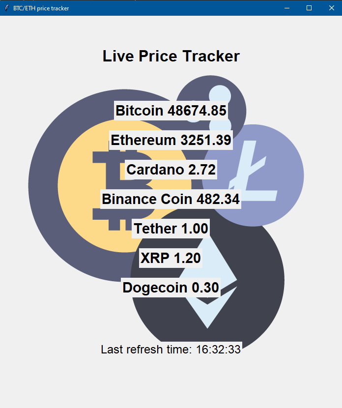

/////////////////////////////Апликација за приказ тренутних вредности криптовалута\\\\\\\\\\\\\\\\\\\\\\\\\\\\\\\\\\\\\\\

Графички интерфејс за апликацију развијен је коришћењем библиотеке Tkinter.

Програм чита тренутне вредности преко API сајта www.coinmarketcap.com, где је потребно направити бесплатан налог како бисте добили свој приватни кључ.
Након креирања налога сајт пружа увид у искоришћеност података, када је и колико података позивано и колико је позива преостало.

Затим изабрани подаци за читање у овом случају, валуте и вредност у америчким доларима, се форматирају и прослеђују графичком интерфејсу.
Валуте које се приказују су:
1.BTC
2.ETH
3.ADA
4.BNB
5.USDT
6.XRP
7.DODGE

Приказане валуте тренутно имају највећи marketcap.

Освежаванје вредности се извршава након 1 секунде.

У прилогу се налази изглед графичког интерфејса

